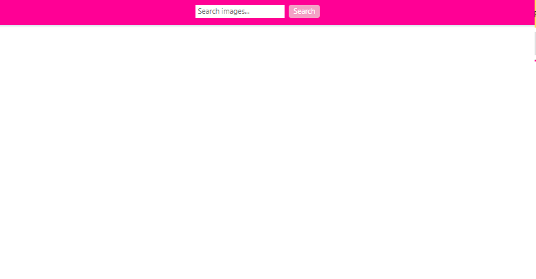
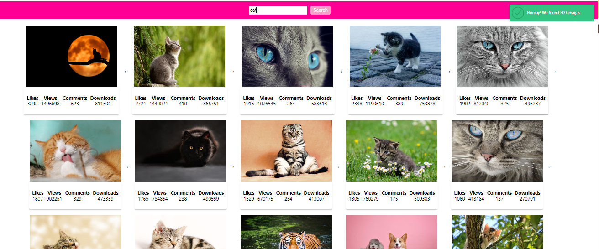

# Images
This project was created to provide a convenient way to search for photos using the Pixabay API. Within the project, the following features were implemented:

## Utilization of Pixabay API:
 The project leverages the Pixabay API to retrieve photos based on user input keywords.

 .
## Empty Result Message:
 In case the backend returns an empty array, the program displays a message with the text "Sorry, there are no images matching your search query. Please try again." using the notiflix library.
 .

## Pagination:
 The Pixabay API supports pagination, so each response returns 40 photo objects instead of the default 20.
 .

## Total Images Message:
 After each request, a message is displayed showing the total number of images found (property totalHits). For example, "Hooray! We found totalHits images."
 .
 
## SimpleLightbox Library:
 The project utilizes the SimpleLightbox library to create a full-fledged photo gallery. Each image card is wrapped in a link as specified in the documentation, and the refresh() method is called after adding a new group of image cards to refresh the gallery.
 .

## Page Scrolling:
 After each request, the page smoothly scrolls for user convenience.

### Parcel template
This project was created using Parcel. For more information and to explore additional features,[ refer to the documentation.](https://parceljs.org/).

## Контакти
If you have any questions, suggestions, or need assistance, feel free to contact our support team at Liussi@ukr.net.