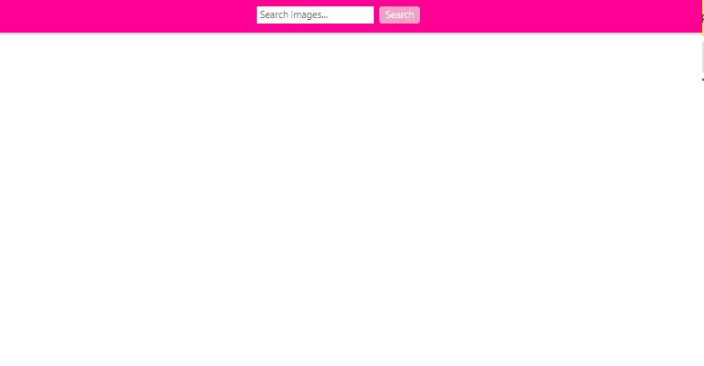
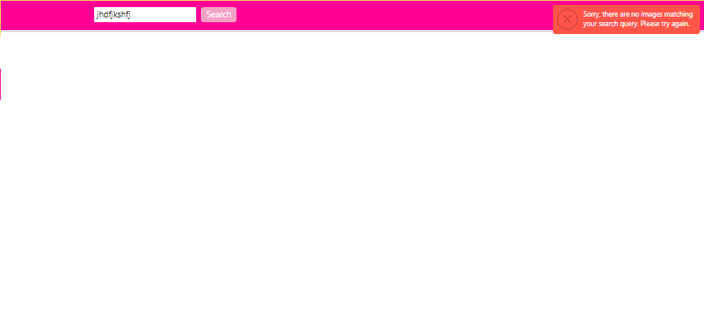
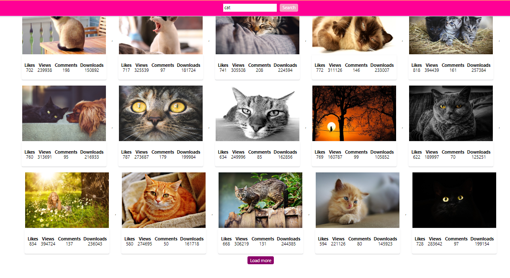
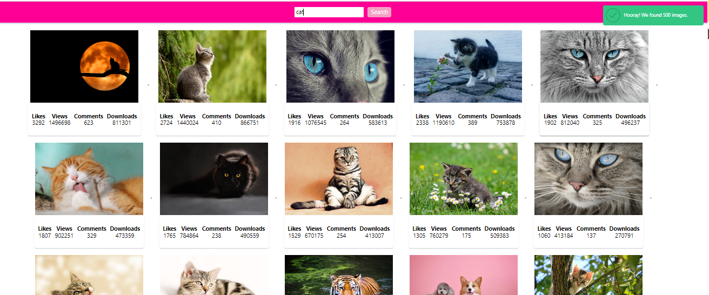
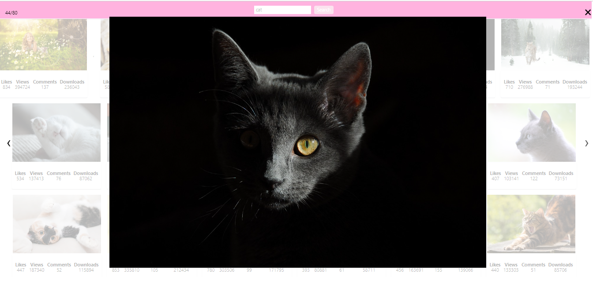

# Images
Цей проект був створений для зручного пошуку фотографій за допомогою публічного API сервісу Pixabay. В рамках проекту було реалізовано наступне:

## Використання Pixabay API: 
Для отримання фотографій було використано публічне API сервісу Pixabay. Користувач може вводити ключові слова для пошуку фотографій.

 .
## Повідомлення про порожній результат:
 Якщо запит до бекенду повертає порожній масив, програма виводить повідомлення з текстом "Sorry, there are no images matching your search query. Please try again." використовуючи бібліотеку notiflix.
 .

## Пагінація: 
Pixabay API підтримує пагінацію, тому в кожній відповіді приходить 40 об'єктів фотографій замість 20 (за замовчуванням).
 .

## Повідомлення про загальну кількість зображень:
 Після кожного запиту виводиться повідомлення, яке показує кількість всього знайдених зображень (властивість totalHits). Наприклад, "Hooray! We found images."
 .

## Бібліотека SimpleLightbox:
 Для створення повноцінної галереї фотографій використовується бібліотека SimpleLightbox. 
 .

## Прокручування сторінки:
 Після кожного запиту відбувається плавне прокручування сторінки для зручності користувача.

### Parcel template
Цей проект був створений за допомогою Parcel. Для ознайомлення та налаштування додаткових можливостей [звернись до документації.](https://parceljs.org/).

## Контакти
Якщо у вас є питання, пропозиції або вам потрібна допомога, не соромтеся звертатися до нашої служби підтримки за адресою Liussi@ukr.net